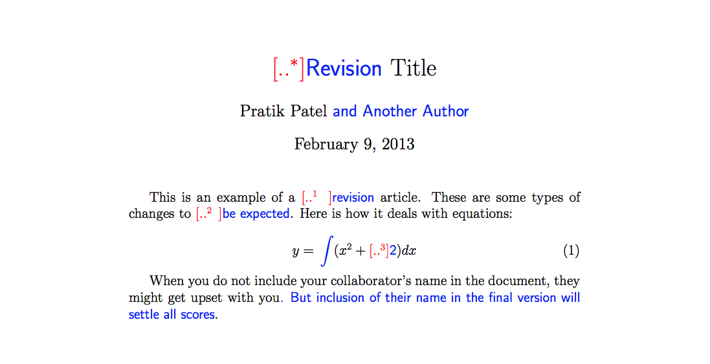
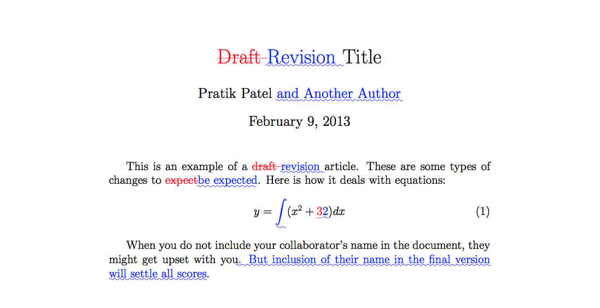

# LaTeX-Diff-Scripts
Scripts which automate the tedious production of organised change-tracking documents for LaTeX projects, including providing a substitute for git-latexdiff for Windows

# "Installation"

1. Install dependencies
2. Copy the scripts in a LaTeX project folder
3. Customise the compilation steps in `compile.ps1` to the preferred ones (e.g. specific choices of compiler, glossary generator and reference handler)
4. Optionally: customise the latexdiff settings where it is called in `compile_diff.ps1` and `compile_diff_git.ps1`; by default the only option is `-t CTRADITIONAL` (for info on latexdiff output styles see subsection "Predefined styles" and adjacent ones in section 4 of the [latexdiff documentation](https://mirrors.nxthost.com/ctan/support/latexdiff/doc/latexdiff-man.pdf))

## Dependencies

The LaTeX packages `latexpand` and `latexdiff` (on Windows, most easily installable in the [MiKTeX](https://miktex.org/download) Console).

NOTE: The latexdiff package (script, really) requires Perl and the Algorithm::Diff module:
1. Install [Perl](https://www.perl.org/get.html) (e.g. [Strawberry Perl](https://strawberryperl.com/) on Windows)
2. Go to the Perl bin folder (e.g. `C:\Strawberry\perl\bin`) and run `perl -MCPAN -e "install Algorithm::Diff"`

# Use 

- Run `compile.ps1` to simply compile the project
- Run `compile_diff.ps1` to generate a single-file .tex and a .pdf for the current state and for the differences with a given past version (likely previously saved with this same script).
Versions and their comparisons are stored in a "Progress" folder in the same path as the scripts, and their naming convention is of v0, v1 etc for simple files and v0to1, v1to2 etc for comparisons
- Run `compile_diff_git.ps1` to essentially do the same as the above but without organising the versions in a progress folder and instead accessing a previous commit to generate an "old" version to compare the current state with (i.e. what git-latexdiff does, but in a Windows context)
- Run `compile_extended.ps1` to reduce the project to a single .tex file and then compile it; this is really intended to be used by the diff scripts, but feel free to call it directly

# Documentation

Simply run the `Get-Help` cmdlet (with flags for more details and examples) with a script name, e.g. `PS> Get-Help .\compile_diff.ps1 -Detailed`.
(Alternatively: just look at the preamble in each script for the same information)

# Latexdiff example outputs

|  |
|:--:|
| <b>With `-t CTRADITIONAL`, i.e. the default in the scripts</b> |

|  |
|:--:|
| <b>With no additional arguments</b> |

